# Client VPN: Private AWS VPN Connection

The AWS Client VPN offers a managed VPN service that enables remote employees to securely connect to AWS-based and on-premises network resources. It's designed to be scalable, adjusting its capacity to meet user demand without manual intervention. This ensures a consistent access experience for users during the transition of applications to the AWS environment. The service is compatible with the OpenVPN protocol and includes a software client for establishing VPN connections.

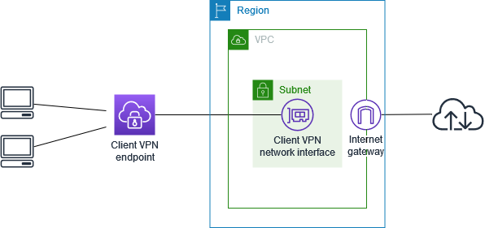

**Table of Contents**

- [Client VPN: Private AWS VPN Connection](#client-vpn-private-aws-vpn-connection)
  - [Prerequisites](#prerequisites)
    - [SSO Application Setup (AWS MGMT Account)](#sso-application-setup-aws-mgmt-account)
    - [Create an IAM Identity provider (VPN Account)](#create-an-iam-identity-provider-vpn-account)
    - [Generate an ACM Certificate](#generate-an-acm-certificate)
    - [Network and Security Groups](#network-and-security-groups)
  - [Usage](#usage)
  - [Requirements](#requirements)
  - [Providers](#providers)
  - [Modules](#modules)
  - [Resources](#resources)
  - [Inputs](#inputs)
  - [Outputs](#outputs)
  - [Connecting](#connecting)
  - [Testing](#testing)


## Prerequisites

Ensure the following requirements are in place:

1. Permissions required to work with Client VPN endpoints.
2. Permissions required to create or import certificates into AWS Certificate Manager.
3. A VPC with at least one subnet and an internet gateway. The route table that's associated with the VPCs subnets must have a route to the internet gateway.
4. A SAML provider (AWS IAM Identity Center or Microsoft Entra)

### SSO Application Setup (AWS MGMT Account)

This will only need to be done once in total. It's simply a prerequisite and does not need to be completed for every VPN deployment. Skip this step if it's already done.

1. `Navigate` to the AWS console of the `Management (primary) account`.
2. `Open` the `AWS IAM Identity Center Applications` console.
3. `Create` a new `SSO Application` for the VPN Client authorization.
4. `Click` the `Add application` orange button on the top right.
5. `Click` the `I have an application I want to set up` option.
6. `Select` the `SAML 2.0` option for the for Application type.
7. `Click` the Orange `Next` button.
8. `Configure` the `Application` as follows
    - Display Name: `VPN Client`
    - Description: `Client VPN Access`
    - Application ACS URL: `http://127.0.0.1:35001`
    - Application SAML audience: `urn:amazon:webservices:clientvpn`
9. Click the link to `download` the `AWS SSO metadata file`. You will need this metadata file when you create the IAM identity provider.
10. Click `Submit`
11. Under `Actions` select `Edit attribute mappings`. In this case, only two mappings are required.
    - Subject: `${user:email}: emailAddress`
    - LastName: `${user:familyName}: unspecified`
    - FirstName: `${user:givenName}: unspecified`
    - memberOf: `${user:groups}: unspecified`
    - Name: `${user:email}: unspecified`
12. `Assign a group` under the `Groups` tab in the `Assign users and groups` page.
    - `Select` the correct group names.
    - `Click` the `Assign users` Orange button.
13. `Create` another `SSO Application` for the VPN Client `Self Service Portal`.
    1.  `Click` the `Add application` orange button on the top right.
    2.  `Click` the  `I have an application I want to set up` option.
    3.  `Select` the `SAML 2.0` option for Application type.
    4.  `Click` the Orange `Next` button.
    5.  `Configure` the `Application` as follows
        - Display Name: `VPN Client Self Service`
        - Description: `VPN Client Access for the Self Service Portal`
        - Application ACS URL: `https://self-service.clientvpn.amazonaws.com/api/auth/sso/saml`
        - Application SAML audience: `urn:amazon:webservices:clientvpn`
    6.  `Click` the link to `download` the `AWS SSO metadata file`. You will need this metadata file when you create the IAM identity provider.
    7.  `Click` the `Submit` button.
    8.  Under `Actions` select `Edit attribute mappings`. In this case, only two mappings are required.
        - Subject: `${user:email}: emailAddress`
        - LastName: `${user:familyName}: unspecified`
        - FirstName: `${user:givenName}: unspecified`
        - memberOf: `${user:groups}: unspecified`
        - Name: `${user:email}: unspecified`
    9.  `Assign a group` under the `Groups` tab in the `Assign users and groups` page.
        - `Click` on the correct `group name`.
        - `Click` the `Assign users` Orange button.

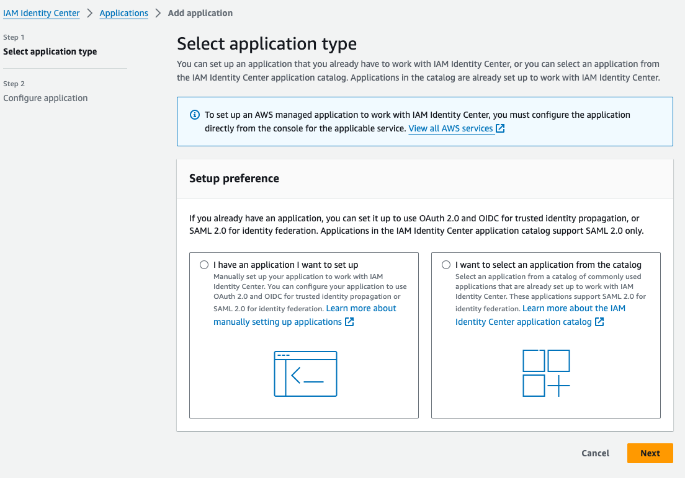
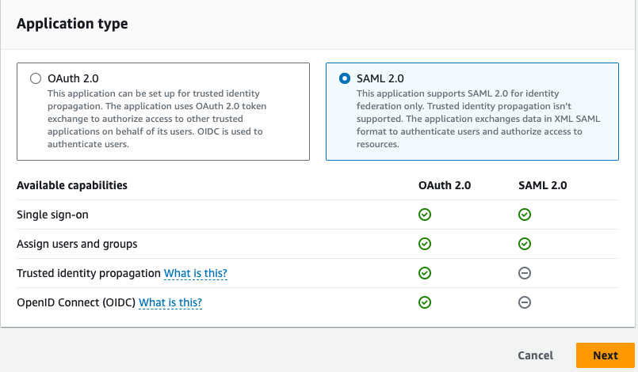
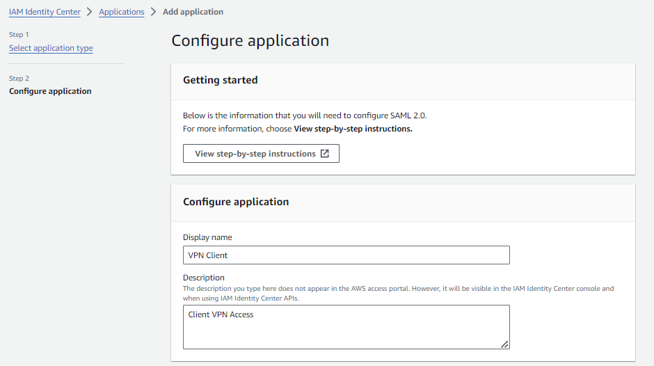
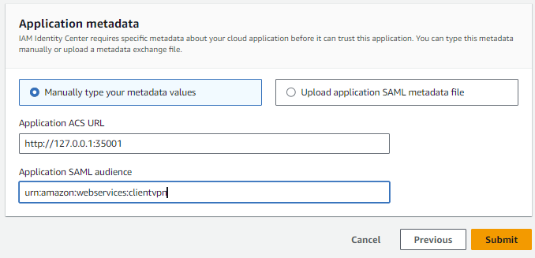
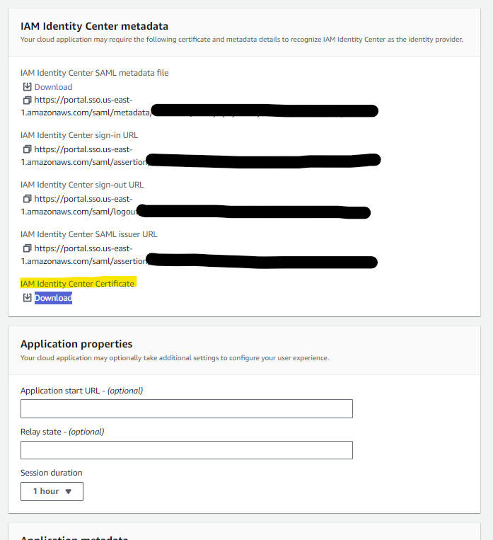
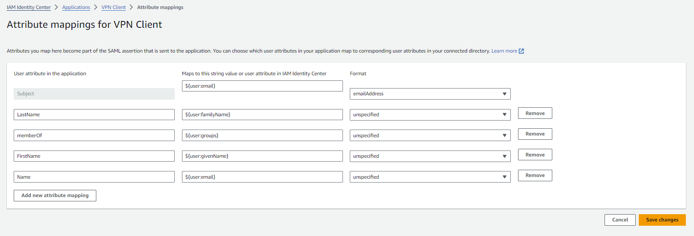
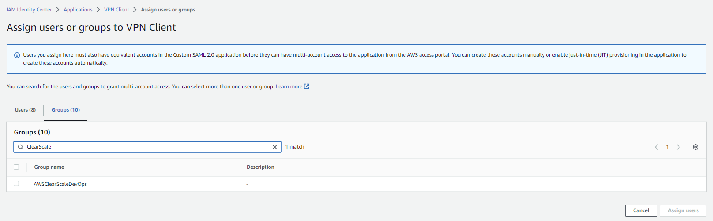
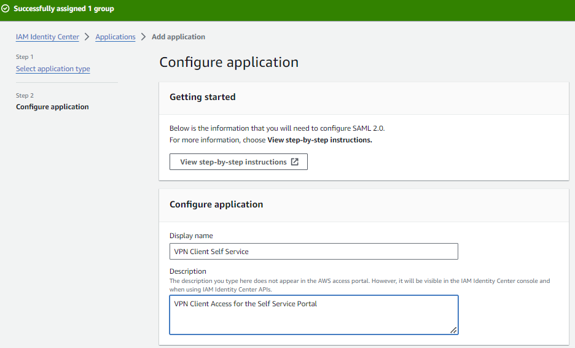
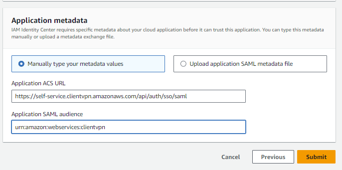

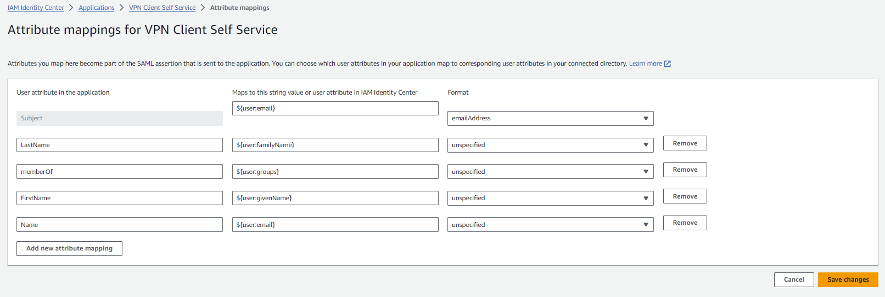
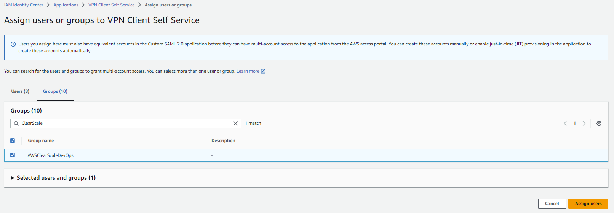

### Create an IAM Identity provider (VPN Account)

The IAM identity provider bridges the gap between the identity provider, like AWS SSO, and IAM which helps assign the appropriate IAM permissions to users. `This needs to be done once for every account a VPN is configured for.`

1. `Access` the `AWS Account` where VPN will be deployed.
2. `Navigate` to the IAM page in the AWS console.
3. `Click` in the left navigation column for `Identity providers`.
4. `Click` the orange `Add provider` to create the VPN Client IDP.
5. `Select` the `SAML` option for the Provider type.
    - Provider name: `cs-vpn-client`
    - Add tags
    - Name: `cs-client-vpn`
6. `Upload` the `metadata file` that was downloaded when the SSO application was created in the Management account.
7. Repeat.
8. `Click` the orange `Add provider` to create the Identity Provider.
9. `Select` the `SAML` for the Provider type.
    - Provider name: `cs-vpn-client-ss`
    - Add tags
    - Name: `cs-client-vpn-ss`
10. `Upload` the `metadata file` that was downloaded when the SSO application **for Self Service** was created in the Management account.
11. `Click` the `Add provider` button.

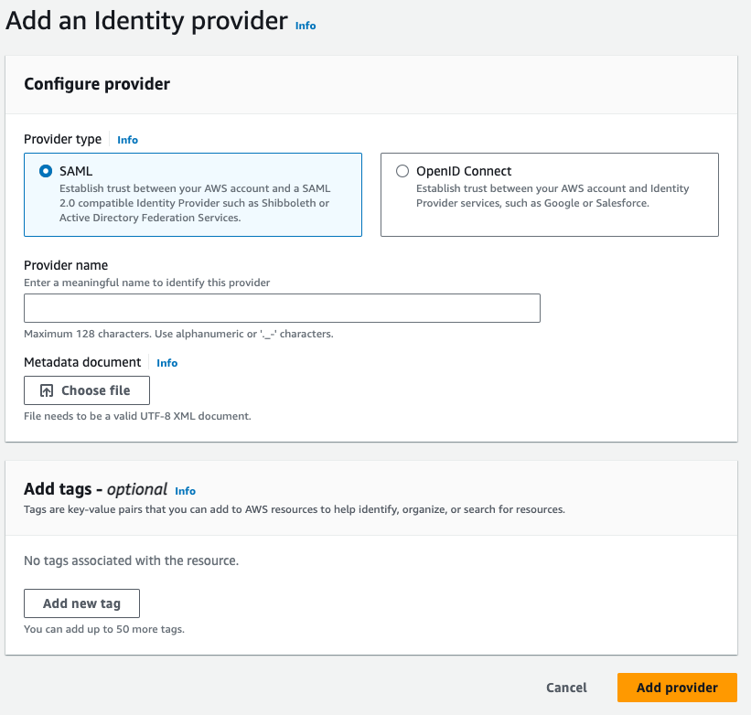

Repeat starting at Step #8 above.

### Generate an ACM Certificate

`ACM certificates must be requested in the same region and account where the Client VPN endpoint will be created.` See [How to deploy public ACM certificates across multiple AWS accounts and Regions using AWS CloudFormation StackSets](https://aws.amazon.com/blogs/security/how-to-deploy-public-acm-certificates-across-multiple-aws-accounts-and-regions-using-aws-cloudformation-stacksets/) for a centralized option. 

Follow these steps to create an ACM certificate:

1. `Access` the `AWS Account` and `region` where VPN will be deployed.
2. `Open` the `Route 53` console and create a new public Hosted Zone if needed. Step #5 requires a public domain name so if the certificate will be registered to `*.dev.example.com` and public Hosted Zone needs to be created for `dev.example.com`. The Hosted Zone will need to be validated by either DNS or Email, so the organization owner for the domain will need to approve the  request.
3. `Open` the `AWS Certificate Manager (ACM)` console. 
4. 4. `Request` a `Certificate`
    - `Click` on `Request`.
    - `Choose` the `Request a public certificate` option.
    - `Click` the `Next` button.
5. `Add` the `Domain Names`.
    - `Enter` the `domain names` to be secured with the certificate.
    - `Use` a `wildcard` to `secure subdomains` (e.g., `*.example.com`).
6. `Select` the `Validation Method`
    - `Choose` either `DNS validation` or `email validation`.
    - DNS validation is recommended for faster issuance.
7. `Select` the `Key Algorithm`.
   - Use RSA 2048 if in doubt.
8. `Add` resource `Tags` (Optional)
9.  `Review` and `click` the `Request` button.
10. `Validate` the `Domain`
    - Follow the instructions to validate the domain via DNS or email.
    - `For DNS` validation, `add the CNAME record` to the DNS configuration.
    - `For email` validation, `click` the `approval` link` in the email sent to the domain's registered contact.
11. `Wait until the certificate's status changes` to `Issued` after the verification process completes.
12. `Save` the `ARN` of the certificate. It will be needed when configuring the VPN Endpoint.

### Network and Security Groups

Ensure that the VPC and Subnets which the VPN should access exist, and that the Security Groups for controlling network access across the VPN is established. The IDs of these resources will be required when creating the VPN Endpoint. At a minimum, `var.vpn_port` (defaults to 443) should be open. If connectivity issues arise with certain services but not others, ensure that the ports for those affected services are also open.

NOTE: `These resources should exist in the same account and region as the Client VPN Endpoint`.

## Usage

Source this module using the following Terraform example:

```
module "vpn" {
  source = "../../../../mod/service/tf-aws-vpn-client"

  # Customize for each account/region/VPC
  description                    = "my-client-vpn"
  client_cidr                    = "10.0.4.0/22"
  dns_servers                    = [] # .2 Address of the VPC CIDR block. Will be generated if not provided.
  security_group_ids             = ["SECURITY_GROUP_ID"]
  server_certificate_arn         = "ACM_CERTIFICATE_ARN"
  saml_provider_arn              = "IAM_IDENTITY_PROVIDER_ARN"
  self_service_saml_provider_arn = "IAM_IDENTITY_PROVIDER_SELF_SERVICE_ARN"

  # Standard across all accounts, regions, and VPCs.
  client_certificate_arn         = null
  vpc_id                         = module.vpc.vpc_id
  vpc_cidr                       = module.vpc.vpc_cidr_block
  subnet_ids                     = module.vpc.private_subnets
}
```

<!-- BEGIN_TF_DOCS -->
## Requirements

No requirements.

## Providers

| Name | Version |
|------|---------|
| <a name="provider_aws"></a> [aws](#provider\_aws) | n/a |

## Modules

| Name | Source | Version |
|------|--------|---------|
| <a name="module_std"></a> [std](#module\_std) | github.com/clearscale/tf-standards.git | v1.0.0 |

## Resources

| Name | Type |
|------|------|
| [aws_ec2_client_vpn_authorization_rule.this](https://registry.terraform.io/providers/hashicorp/aws/latest/docs/resources/ec2_client_vpn_authorization_rule) | resource |
| [aws_ec2_client_vpn_endpoint.this](https://registry.terraform.io/providers/hashicorp/aws/latest/docs/resources/ec2_client_vpn_endpoint) | resource |
| [aws_ec2_client_vpn_network_association.this](https://registry.terraform.io/providers/hashicorp/aws/latest/docs/resources/ec2_client_vpn_network_association) | resource |
| [aws_ec2_client_vpn_route.this](https://registry.terraform.io/providers/hashicorp/aws/latest/docs/resources/ec2_client_vpn_route) | resource |
| [aws_security_group.this](https://registry.terraform.io/providers/hashicorp/aws/latest/docs/resources/security_group) | resource |
| [aws_vpc_security_group_egress_rule.allow_all_traffic_ipv4](https://registry.terraform.io/providers/hashicorp/aws/latest/docs/resources/vpc_security_group_egress_rule) | resource |
| [aws_vpn_gateway.this](https://registry.terraform.io/providers/hashicorp/aws/latest/docs/resources/vpn_gateway) | resource |

## Inputs

| Name | Description | Type | Default | Required |
|------|-------------|------|---------|:--------:|
| <a name="input_account"></a> [account](#input\_account) | (Optional). Current cloud provider account info. | <pre>object({<br>    key      = optional(string, "current")<br>    provider = optional(string, "aws")<br>    id       = optional(string, "*") <br>    name     = string<br>    region   = optional(string, null)<br>  })</pre> | <pre>{<br>  "id": "*",<br>  "name": "shared"<br>}</pre> | no |
| <a name="input_client"></a> [client](#input\_client) | (Optional). Name of the client | `string` | `"ClearScale"` | no |
| <a name="input_client_certificate_arn"></a> [client\_certificate\_arn](#input\_client\_certificate\_arn) | The ARN of the client certificate. | `string` | `null` | no |
| <a name="input_client_cidr"></a> [client\_cidr](#input\_client\_cidr) | The network range to use for clients. Must be a /22 or larger. | `string` | n/a | yes |
| <a name="input_description"></a> [description](#input\_description) | The description of the Client VPN. | `string` | `"Client VPN"` | no |
| <a name="input_dns_servers"></a> [dns\_servers](#input\_dns\_servers) | VPC CIDR (var.vpc\_cidr) block .2 address. Example: VPC is 10.51.0.0/19, DNS is 10.51.0.2. | `list(string)` | `[]` | no |
| <a name="input_env"></a> [env](#input\_env) | (Optional). Name of the current environment. | `string` | `"dev"` | no |
| <a name="input_name"></a> [name](#input\_name) | (Optional). The name of the resource, application, or service. | `string` | `"vpn"` | no |
| <a name="input_prefix"></a> [prefix](#input\_prefix) | (Optional). Prefix override for all generated naming conventions. | `string` | `"cs"` | no |
| <a name="input_project"></a> [project](#input\_project) | (Optional). Name of the client project. | `string` | `"pmod"` | no |
| <a name="input_region"></a> [region](#input\_region) | (Optional). Name of the region. | `string` | `"us-west-1"` | no |
| <a name="input_saml_provider_arn"></a> [saml\_provider\_arn](#input\_saml\_provider\_arn) | The ARN of the SAML provider for federated authentication. | `string` | n/a | yes |
| <a name="input_security_group_ids"></a> [security\_group\_ids](#input\_security\_group\_ids) | A list of security group IDs to apply to the Client VPN network interface. If none are specified a security group is created automatically. | `list(string)` | `[]` | no |
| <a name="input_self_service_saml_provider_arn"></a> [self\_service\_saml\_provider\_arn](#input\_self\_service\_saml\_provider\_arn) | The ARN of the self-service SAML provider. | `string` | n/a | yes |
| <a name="input_server_certificate_arn"></a> [server\_certificate\_arn](#input\_server\_certificate\_arn) | The ARN of the server certificate. | `string` | n/a | yes |
| <a name="input_subnet_ids"></a> [subnet\_ids](#input\_subnet\_ids) | A list of subnet IDs to be associated with the Client VPN. These are the subnets associated with var.vpc\_id. | `list(string)` | n/a | yes |
| <a name="input_tags"></a> [tags](#input\_tags) | Additional tags to be merged with the default tags | `map(string)` | `{}` | no |
| <a name="input_vpc_cidr"></a> [vpc\_cidr](#input\_vpc\_cidr) | The CIDR block for the VPC associated with the Client VPN (CIDR for var.vpc\_id). | `string` | n/a | yes |
| <a name="input_vpc_id"></a> [vpc\_id](#input\_vpc\_id) | The ID of the VPC to associate with the Client VPN. | `string` | n/a | yes |
| <a name="input_vpn_port"></a> [vpn\_port](#input\_vpn\_port) | The port to use for the Client VPN. | `number` | `443` | no |

## Outputs

No outputs.
<!-- END_TF_DOCS -->

## Connecting

1. `Download` the [VPN Client](https://aws.amazon.com/vpn/client-vpn-download/) for Windows, MacOS or Ubuntu Linux.
2. `Run` the `installer`.
3. `Obtain` the `Client Configuration file`.
    - This can be done by proceeding to the Client VPN Endpoints section located on the VPC page.
    - The appropriate Client VPN Endpoint must be selected to download the configuration file, and then the `Download Client Configuration` button must be clicked.
4. `Add` a new `connection profile` to the client.
    - This is done by selecting File > Manage Profiles.
    - `Click` the `Add Profile` button.
    - `Desginate` a `name for the VPN Connection`.
    - `Select` the `configuration file` previously downloaded in step #3.
    - `Click` the `Add Profile` button to complete this process.
5. `Choose` the `newly created profile`.
    - The client will initiate a connection to AWS SSO via a web browser. In the event of prior authentication to AWS SSO, a notification stating "Authentication details received, processing details. You may close this window at any time." will appear. Refer to the images below for an illustration.
    - The VPN Client should now show `Connected`

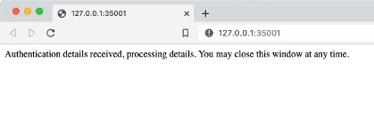
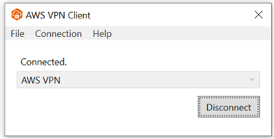

## Testing

To ensure the VPN connection is functioning, the Route 53 resolver within each VPC provides a straightforward testing method. Given a `VPC CIDR of 10.10.0.0/16`, the Route 53 resolver's `IP address would be 10.10.0.2`. Testing involves querying the resolver using the command: `nslookup 10.10.0.2 10.10.0.2`, which resolves the IP address 10.10.0.2 against the resolver itself. This procedure is compatible with both macOS and Windows environments. Despite the output differences between these systems, the test will conclusively demonstrate the VPN's connectivity status.

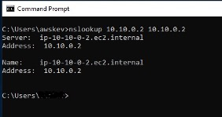
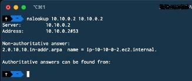